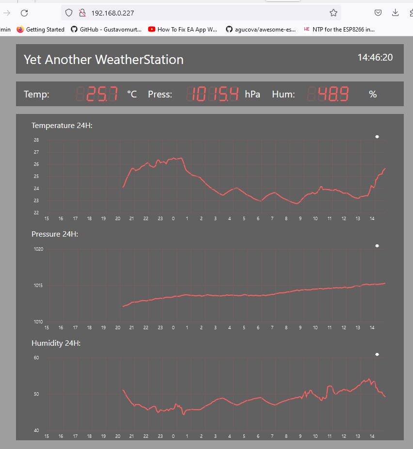

# Yet another WeatherStation

This project is not fully finished and may contain bugs. Though it is already very useable.

Based on a ESP12E (ESP8266 8Mbit flash) and a BME280 sensor.

This project was emerged from creating a compress-utility for compressing HTML, to counter the burden of converting html to PROGMEM or uploading through file FS-upload.

It has some interesting features (I think):

- Asycwebserver with websockets
- Logging of temp/hum/press of the past 24H (internally 32 days, so could be expanded to look-back a month)
- A compress utility that will converge index.html with local .css and .js files, compress the resulting html and create a PROGMEM byte-array in the apphtml.h in the include folder.  
  Compression will result in an approx 70-80% reduction of file size, the PROGMEM data then can be send to the webclient with "Content-Encoding", "gzip".  
  server.on("/", HTTP_GET, \[\](AsyncWebServerRequest \*request) // send gzipped index (gzip))  
  {  
  AsyncWebServerResponse \*response = request->beginResponse_P(200, "text/html", index_html_gz, sizeof(index_html_gz));  
  response->addHeader("Content-Encoding", "gzip");  
  request->send(response); });  
  Apart from less memory consumption, this will lead to faster load times, but also to easier editing since you can test the html through live-server in Studio Code without converting to c++  
  specific format. It outperforms LittleFS/SPIFFS and for most tasks is easier to use. On top of that, your SPIFFS or LittleFS on the ESP will remain intact, handy when you are logging data there.  
  The script will be started at pre-compile time so that the html files will be included in every compile. To do so in your platformio.ini configure:  
  extra_scripts = pre:CompressHtml.py  
  Expect html/js/css file reduction of 2-4 times, on top of that is the converging, these together will result in fast loading times.

todo:

- cleanup c++
- Month and date lookback
- use Sd-card for storage instead of flash to hold data and look back virtually infinite
- expansion with other sensors, rain, wind, sun, pollution, etc.

Remarks:
- this is ment for building with PlatformIO
- You will need to init LittleFs first time to use this !
